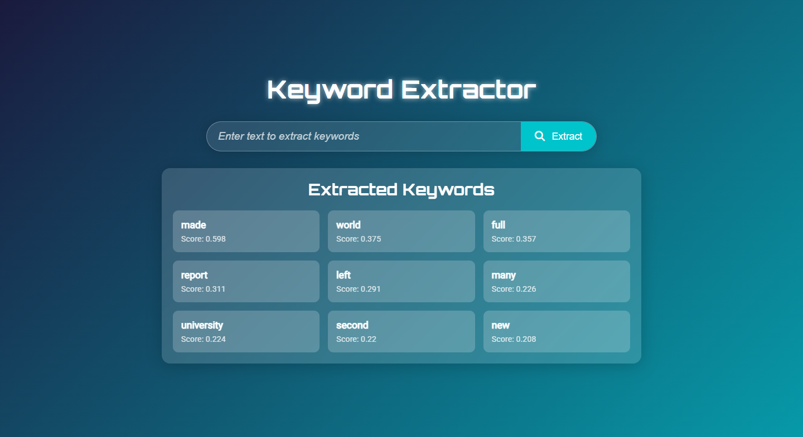

# Keyword Extractor

Keyword Extractor (Optional: Add a screenshot of your app in myapp/static/images/ and update the path if available)

Keyword Extractor is a Django-based web application that extracts key terms from input text using Term Frequency-Inverse Document Frequency (TF-IDF). The application provides a sleek, user-friendly interface where users can input text, submit it, and receive a list of the top keywords ranked by their TF-IDF scores. The backend leverages scikit-learn’s CountVectorizer and TfidfTransformer to process text, and the frontend uses a modern, responsive design with animated gradients and glassmorphism effects.

## Table of Contents

- Features
- Project Structure
- Prerequisites
- Installation
- Usage
- Screenshots
- Contributing
- License
- Contact

## Features

- Keyword Extraction: Extracts top keywords from user-provided text using a pre-trained TF-IDF model.
- Responsive Design: Modern interface with an animated gradient background, glassmorphism effects, and a responsive layout for desktop and mobile devices.
- User-Friendly: Simple text input form with a dynamic results display showing keywords and their TF-IDF scores.
- Pre-trained Models: Uses serialized CountVectorizer (cv.pkl) and TfidfTransformer (tfidf.pkl) models for efficient keyword extraction.
- Customizable: Easily extendable for additional preprocessing (e.g., stopwords, stemming) or UI enhancements.

## Project Structure

```bash
keyword-extractor/
├── .gitignore
├── db.sqlite3
├── manage.py
├── README.md
├── requirements.txt
├── myapp/
│   ├── admin.py
│   ├── apps.py
│   ├── cv.pkl
│   ├── feature_names.pkl
│   ├── models.py
│   ├── sustain.py
│   ├── tests.py
│   ├── tfidf.pkl
│   ├── urls.py
│   ├── views.py
│   ├── __init__.py
│   ├── migrations/
│   │   ├── 0001_initial.py
│   │   ├── __init__.py
│   │   └── __pycache__/
│   ├── static/
│   │   ├── css/
│   │   │   └── style.css
│   │   ├── images/
│   │   └── js/
│   │       └── script.js
│   ├── templates/
│   │   └── index.html
│   └── __pycache__/
└── myproject/
    ├── asgi.py
    ├── settings.py
    ├── urls.py
    ├── wsgi.py
    ├── __init__.py
    └── __pycache__/
```

## Prerequisites

- Python: 3.11 or later
- Django: 4.x or compatible version
- Dependencies: Listed in `requirements.txt`
- Web Browser: Chrome, Firefox, or other modern browser

## Installation

```bash
# Clone the repository
git clone https://github.com/your-username/keyword-extractor.git
cd keyword-extractor

# Create a virtual environment
python -m venv venv
source venv/bin/activate        # On Windows: venv\Scripts\activate

# Install dependencies
pip install -r requirements.txt

# Apply database migrations
python manage.py migrate

# Collect static files
python manage.py collectstatic

# Run the development server
python manage.py runserver
```

Now open your browser and go to:  
📍 http://127.0.0.1:8000/

## Usage

- **Input Text:** Enter your text in the input field.
- **Submit:** Click “Extract” to process and extract keywords.
- **Results:** View the top keywords and their TF-IDF scores in styled cards.

### Example

Input:
```
Neural network for pattern classification and generalization performance.
```

Output:
```
neural network: 0.454  
pattern: 0.321  
generalization: 0.312  
classification: 0.298
```

## Screenshots




## Contributing

Contributions are welcome! To contribute:

```bash
# Fork the repository
git checkout -b feature/your-feature

# Make your changes
git commit -m "Add your feature"

# Push your branch
git push origin feature/your-feature
```


